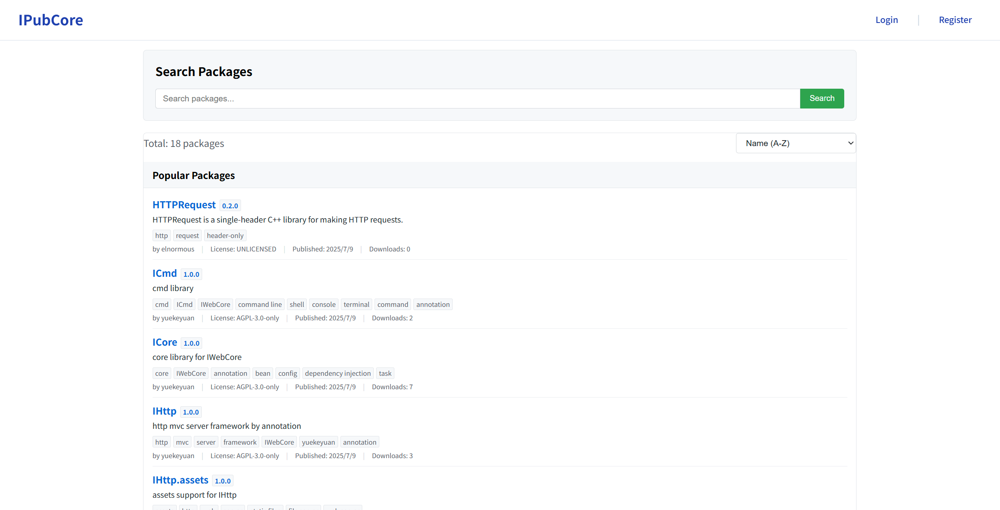

# IPubCore 包服务器

> 本文档描述 IPubCore 的使用方法。


## 题外话

IWebCore整个框架的设计目标是对标于 Spring 的整个平台。IMakeCore 则是对标于 maven/gradle 这样的包管理工具的。所以除了 MakeCore 的内置包之外，用户也应该能够从远端自动下载包到本地，和项目一起编译运行。

所以在IWebCore的开发过程中，同样也编写了一个包管理的服务器，和IMakeCore的本地服务一同工作，用户可以配置 包管理服务器上的包，IMakeCore会自动下载这些包，并将包集成到项目中去。

这个地址之前是 https://pub.iwebcore.org，有一个正儿八经的域名，并且 https 也已经做好了。前期由于自己的事情太多，也没管的上这块的内容，先是 https 失效，后面是服务器续费不起，换了国内一年99块的服务器，国内的服务器不能绑定 .org / .io 这样的域名，之前的com 域名也被抢注，所以现在这个网站在裸奔了。用户可以直接使用 ip (115.191.52.106) 来访问 IPubCore网站。

另外，运营一个内容性质的网站不是把网站挂上去就行了，还需要考虑到用户上传的内容的合法性。这个需要消耗大量的精力，我也没有这个精力做这一个事情，所以用户可以注册，但是注册之后并不能上传自己的包，如果想上传包的话，请和我联系。

以下是正文：


## IPubCore网站

IPubCore 网站是 IMakeCore 用于查找和下载包的网站，地址是 [IPubCore](http://115.191.52.106/) ，http://115.191.52.106/。

IPubCore 是由 IWebCore 中 IHttpCore 框架编写的后端，react 编写的前端，这里推荐用户使用 IHttpCore 来编写自己的 http 服务器。

用户可以在这个网站上搜索各类的包，搜索到的包可以将包名和版本写到 packages.json 文件中去。IMakeCore 会自动下载该包，并集成该版本的包。

IPubCore 网站界面如下所示：




### 查找和使用包

用户在 [搜索页面](http://115.191.52.106/search.html) 输入关键字进行搜索。搜索到的包点击进去就可查看相关的详细信息。


### 注册和登录

用户通过网站顶部右上角的 [登录](http://115.191.52.106/login.html) / [注册](http://115.191.52.106/register.html) 按钮进行用户的注册和登录。

### 如何发布包

#### 邮箱验证

发布一个包需要进行邮箱验证。

由于网站建设的原因，用户默认不能上传包，需要联系管理员进行申请。管理员会审核用户的申请，并给予相应的权限。
联系管理员 请使用注册的 email 地址 发送邮件到 [管理员邮箱](mailto:yuekeyuan001@gmail.com) 进行确认。

用户发送邮件的时候，需要注明如下内容：

```
I want to publish a package, so I send this email.
我发送这封邮件，我想发布一些包。
```

这里实在抱歉，等我挤出时间了，我一定吧这个给搞好（这个功能缺失很小，但是我现在一方面搞整个系统，一方面也在找工作，时间很紧张）。


#### 打包

目前用户需要手动打包，在之后打包和上传的功能可以由 ipc 工具完成。

用户将能够加载到项目的独立包，直接使用 zip 工具打包成为 .zip 包即可。注意在打包的时候， package.json 文件必须在 zip 文件的根目录中，不能嵌套目录。

关于如何定义一个包，请参考[定义包](./definePackage.md) 的文档。


#### 发布包

用户在登录之后，可以在右上角点击用户名，在弹出菜单中点击 `My Package` 按钮，跳转到 [包管理]([Package Management](http://115.191.52.106/packagemanage.html)) 页面。在页面中，点击上传包，跳转到 [包上传]([上传包 - IPubCore](http://115.191.52.106/packageupload.html)) 页面，将打包好的包 拖拽进去，上传即可。

用户在发布包之前必须验证邮箱。

在上传的过程中，会对包的信息进行验证，如果验证不通过，请按照反馈信息进行修改。


## ipc 与 IPubCore

用户可以在 ipc 工具中操作 IPubCore 中的内容

### 搜索

`ipc search` 命令可以搜索网络上的包, 如下内容是 搜索 json 相关的包。

```
C:\Users\Yue>ipc search -- json

 _____  _    _        _      _____
|_   _|| |  | |      | |    /  __ \
  | |  | |  | |  ___ | |__  | /  \/  ___   _ __  ___
  | |  | |/\| | / _ \| '_ \ | |     / _ \ | '__|/ _ \
 _| |_ \  /\  /|  __/| |_) || \__/\| (_) || |  |  __/
 \___/  \/  \/  \___||_.__/  \____/ \___/ |_|   \___|

Name                       LatestVersion   Summary
yuekeyuan/json_struct      1.0.1           json_struct is a single header only C++ library for parsing JSON directly to C++ structs and vice versa
yuekeyuan/jsoncpp          1.9.6           A C++ library for interacting with JSON data
(yuekeyuan)/nlohmann.json  3.12.0          json library for C++
yuekeyuan/rapidjson        1.0.4           A fast JSON parser/generator for C++ with both SAX/DOM style API
yuekeyuan/simdjson         3.13.1          Parsing gigabytes of JSON per second : used by Facebook/Meta Velox, the Node.js runtime, ClickHouse, WatermelonDB, Apache Doris, Milvus, StarRocks
yuekeyuan/yyjson           0.11.1          The fastest JSON library in C

```


### 安装包

如果用户想要安装远程包，一般只需要将想要的包写在 程序 `packages.json` 文件中即可，此外用户也可以通过 `ipc package install` 命令安装包。`ipc package install` 的使用方法如下：

```
C:\Users\Yue>ipc package install

 _____  _    _        _      _____
|_   _|| |  | |      | |    /  __ \
  | |  | |  | |  ___ | |__  | /  \/  ___   _ __  ___
  | |  | |/\| | / _ \| '_ \ | |     / _ \ | '__|/ _ \
 _| |_ \  /\  /|  __/| |_) || \__/\| (_) || |  |  __/
 \___/  \/  \/  \___||_.__/  \____/ \___/ |_|   \___|

ERROR OCCURED: args list too short for argx to retrive data. arg count less than 1 [Cmd Path]: package install [Cmd Arg Type]: ArgX [ArgX Name]: packageName [ArgX Index]: 1

[CMD]:
    ipc package install
[Memo]:
    install package from remote to system
[Argx]:
    Index  Name         TypeName  Nullable  Memo
    1      packageName  QString   false     to be installed package name
    2      version      QString   true      to be installed package version
```

它可以传入两个参数，一个是包名，另外一个是版本，版本可以省略，省略则请求最新的版本。所以用户如可想要安装  上面搜索到的 `yuekeyuan/yyjson ` 这个包，可以使用如下的命令进行安装：

```
C:\Users\Yue>ipc package install -- yuekeyuan/yyjson

 _____  _    _        _      _____
|_   _|| |  | |      | |    /  __ \
  | |  | |  | |  ___ | |__  | /  \/  ___   _ __  ___
  | |  | |/\| | / _ \| '_ \ | |     / _ \ | '__|/ _ \
 _| |_ \  /\  /|  __/| |_) || \__/\| (_) || |  |  __/
 \___/  \/  \/  \___||_.__/  \____/ \___/ |_|   \___|

download from server:  http://115.191.52.106
QIODevice::write (QFile, "C:\Users\Yue\IMakeCore\.cache\yuekeyuan\yyjson@0.11.1.zip"): device not open
package installed. Name: yuekeyuan@yyjson Version: 0.11.1

```

此时，`yuekeyuan@yyjson` 这个包就安装好了。


