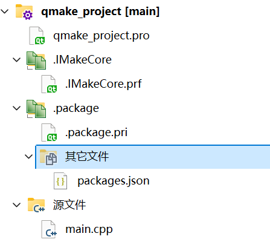
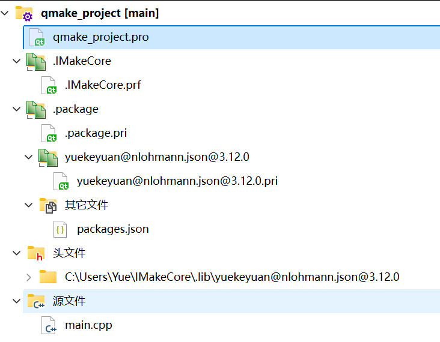

# 使用示例

> 在这篇文档中，写一个 Demo,调用 IMakeCore 中内置的 nolhmann/json 库。


## nlohmann/json 库

在IMakeCore中提前内置了nolhmann/json库，不再需要从网络上同步下载，我们可以直接使用这个库。

还记得我们的 `ipc` 这个工具么？这个工具可以查看到 nlohmann/json 库。执行 `ipc packages` 输出如下：

```bash
C:\Users\Yue>ipc packages

 _____  _    _        _      _____
|_   _|| |  | |      | |    /  __ \
  | |  | |  | |  ___ | |__  | /  \/  ___   _ __  ___
  | |  | |/\| | / _ \| '_ \ | |     / _ \ | '__|/ _ \
 _| |_ \  /\  /|  __/| |_) || \__/\| (_) || |  |  __/
 \___/  \/  \/  \___||_.__/  \____/ \___/ |_|   \___|

Name                            Latest Version   Summary
(yuekeyuan/)asio                1.30.2           asio library for C++
(yuekeyuan/)cpp-httplib         0.22.0           A C++11 single-file header-only cross platform HTTP/HTTPS library.
(yuekeyuan/)cpr                 1.20.0           C++ Requests: Curl for People
(yuekeyuan/)HTTPRequest         0.2.0            HTTPRequest is a single-header C++ library for making HTTP requests.
(yuekeyuan/)ICmd                1.1.0            cmd library
(yuekeyuan/)ICore               1.1.0            core library for IWebCore
(yuekeyuan/)IHttp               1.0.0            http mvc server framework by annotation
(yuekeyuan/)IHttp.assets        1.0.0            assets support for IHttp
(yuekeyuan/)IHttp.cors          1.0.0            cors support for IHttp
(yuekeyuan/)IHttp.session       1.0.0            session support for IHttp
(yuekeyuan/)IHttpPythonTest     1.0.0            python test lib embedded in IHttp
(yuekeyuan/)INody               1.0.0            c++ http template egine
(yuekeyuan/)IRdb                1.0.0            relational database operation library
(yuekeyuan/)ITcp                1.0.0            wrapped asio tcp server
(yuekeyuan/)nlohmann.json       3.12.0           json library for C++
(yuekeyuan/)packaging           1.0.0            python-packaging-like lib for c++, used for version management
(yuekeyuan/)stachenov.quazip    1.5.0            cross-platform C++ zip library
(yuekeyuan/)zlib                1.3.1            cross-platform C++ zip library
yuekeyuan/backward              1.6.0            Printing nice Python-styled stack traces with colors and source snippets, especially on crashes.
```

以上就是IMakeCore中的所有内置的库。此时我们看到库输出中有 nlohmann.json 库：

```bash
(yuekeyuan/)nlohmann.json       3.12.0           json library for C++
```

这个`nlohmann/json` 版本是 `3.12.0`. 


这个库是在IMakeCore 的安装目录中，如下：


IMakeCore目前支持 qmake 和 cmake 两种项目管理工具。

## QMake 下面使用IMakeCore

我们新建一个 qmake project ，这个是一个最简单的什么都没有的 qmake project。 它的目录如下：


文件内容如下：

=== "qmake_project.pro"
    ```pro
    CONFIG += c++11

    SOURCES += \
        main.cpp
    ```

=== "main.cpp"
    ```cpp
    int main()
    {
        return 0;
    }
    ```


此时我们就有了一个默认的项目了。接下来我们就将IMakeCore支持集成到这个项目中。IMakeCore支持集成有两种方式，自动集成和手动集成。

### 自动集成IMakeCore

`ipc` 工具有一个 `init` 子命令，可以在 qmake_project.pro 这个程序目录下面打开命令行工具，执行 `ipc init` 命令。命令的输出如下：

```powershell
D:\code\project\IDemo\qmake_project>ipc init

 _____  _    _        _      _____
|_   _|| |  | |      | |    /  __ \
  | |  | |  | |  ___ | |__  | /  \/  ___   _ __  ___
  | |  | |/\| | / _ \| '_ \ | |     / _ \ | '__|/ _ \
 _| |_ \  /\  /|  __/| |_) || \__/\| (_) || |  |  __/
 \___/  \/  \/  \___||_.__/  \____/ \___/ |_|   \___|

add imake support succeed
```

在命令行中的最后一行输出 `add imake support succeed` 表示 IMakeCore 已经集成到了该项目之中。此时项目的内容也有改变。我们在该项目中再次执行 `qmake` ,此时项目的内容变为：



这个时候目录内容如下：


而这个项目的内容如下：

=== "qmake_project.pro"
    ```pro
    CONFIG += c++11

    SOURCES += \
        main.cpp
    
    include($$(IQMakeCore))
    IQMakeCoreInit()
    include($$PWD/.package.pri)
    ```

=== "main.cpp"
    ```cpp
    int main()
    {
        return 0;
    }
    ```
    
=== "packages.json"
    ```json
    {
        "packages":{

        }
    }
    ```

=== ".package.pri"
    ```pri
    ###################################
    # SYSTEM CONFIGURED, DO NOT EDIT!!!
    ###################################
    
    # inclue packages.json to project
    OTHER_FILES += packages.json 
    ```


这个时候项目已经集成了IMakeCore 的内容。我们接下来把 nlohmann.json 给放到这个项目中。修改 packages.json 的内容如下：

```json
{
    "packages":{
        "nlohmann.json" : "3.12.0"
    }
}
```

我们在 packages.json 中只添加了一行 `"nlohmann.json" : "3.12.0"`内容，此时我们就把 nlohmann.json 集成到了项目中去。

这个时候我们在项目上再次执行 `qmake` ,这个时候项目就会变成如下的内容：



这个时候 nlohmann.json 就已经在项目中了。

### 手动集成IMakeCore

除了 `ipc init` 这个命令之外，用户也可以直接将 如下的内容复制到 项目 pro 文件里面。

```pro
include($$(IQMakeCore))
IQMakeCoreInit()
include($$PWD/.package.pri)
```

执行 qmake 之后，IMakeCore 也被集成到项目中了。此后用户可以在 packages.json 中添加需要的库即可。


## CMake 下面使用 IMakeCore

cmake 中集成 IMakeCore 和 qmake是一样的。可以使用 `ipc init ` 这个命令，也可以手动添加。此时 cmakelists.txt 内容如下：


=== "CMakeLists.txt"
    ```cmake
    cmake_minimum_required(VERSION 3.16)

    project(cmake_project LANGUAGES CXX)
    
    add_executable(cmake_project main.cpp)
    
    include(GNUInstallDirs)
    install(TARGETS cmake_project
        LIBRARY DESTINATION ${CMAKE_INSTALL_LIBDIR}
        RUNTIME DESTINATION ${CMAKE_INSTALL_BINDIR}
    )
    
    include($ENV{ICMakeCore})
    ICMakeCoreInit(cmake_project)
    ```

cmake 中的内容和 qmake 有所不同：

```cmake
include($ENV{ICMakeCore})
ICMakeCoreInit(cmake_project)
```

这里的 ICMakeCoreInit 函数需要传入 project 的名称。

除了 cmakelists.txt 的区别之外，其他的配置和 qmake 项目管理一致，这里不再继续说明。


## 使用 nlohmann.json 


此时我们的IMakeCore集成已经完成，nlohmann.json 也被放置在项目中了。

在 cmake_project 和 qmake_project 修改 main.cpp 内容如下：

```cpp
#include <iostream>
#include <json.hpp>

int main()
{
    using namespace nlohmann;
    auto data = json::array();
    data.push_back(1);
    data.push_back("hello");
    data.push_back(true);
    data.push_back({1,2,3});

    std::cout << data.dump(4);
}
```

这里的内容不在与我们输出的什么内容，而是在于 `#include <json.hpp>` ,我们真正的把 nolhmann.json 给集成进来了,并且没有报错。

项目的运行输出如下：

```txt
[
    1,
    "hello",
    true,
    [
        1,
        2,
        3
    ]
]
```

输出也一切正常。


## 下载

这两个示例可以下载如下， 下载后可以直接运行，编译。

[cmake_project](./assets/cmake_project.zip)

[qmake_project](./assets/qmake_project.zip)

